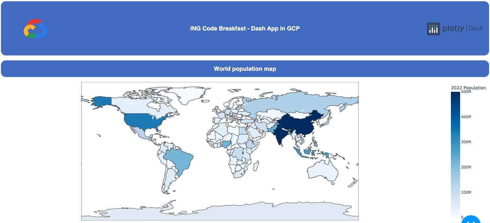
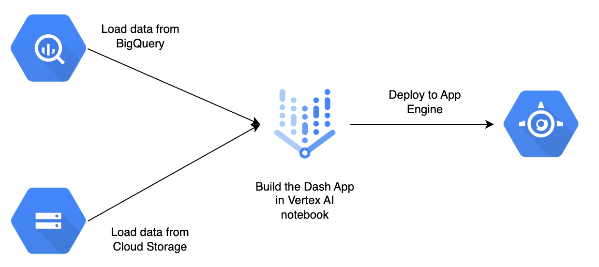

# ING Code Breakfast - Deploy Dash app to GCP App Engine

In this code breakfast we will see how to create a data visualization app with [Dash](https://dash.plotly.com/) and deploy it to [GCP App Engine](https://cloud.google.com/appengine) so to make it available for our users.



This code assumes that a GCP environment is available. In particular the following services are required:

- Big Query
- Cloud Storage
- Vertex AI notebooks
- App Engine

---

The architecture of the application is the following:



---

## Step 0: Explore the GCP environment

In this step, we will perform a basic exploration of the Google Cloud Platform services involved.
In particular, we will:

- Search and Pin the services: BigQuery, Cloud Storage, Vertex AI and App Engine;
- Visualize the dataset object in Cloud Storage;
- Visualize the dataset in BigQuery.

---

## Step 1: Create notebook

Next, we will create a jupyter notebook in GCP Vertex AI workbench.
To do that, we can navigate to Vertex AI -> Workbench -> User-managed notebooks -> New notebook -> Python3


Please specify:

- Notebook name = 'notebook_group_X' (replace X with number of the group)
- Region = europe-west1 (Belgium)
- Zone = europe-west-1-b

Once the notebook has been created, we can click on 'Open JupyterLab' and get access to our Jupyter environment.
Here we can clone this repository by opening the terminal and typing:

```
git clone https://github.com/chrispiro/deploy_plotly_app_on_gcp.git
```

And then we can install the required packages by running:

```
pip install -r requirements.txt
```

Note: You can also create a virtual environment using:

```
python3 -m venv myenv

source myenv/bin/activate
```

And then add the virtual environment to the jupyter notebook:

```
python -m ipykernel install --user --name=myenv
```

---

## Step 2: Read data from BigQuery and Cloud Storage

The dataset we are going to use is ['World Population Dataset'](https://www.kaggle.com/datasets/iamsouravbanerjee/world-population-dataset) from [Kaggle](https://www.kaggle.com/).

The first half of the dataset will be in BigQuery, while the second half will be in Cloud Storage.
We will load the two subsets from the two services and then merge the data into one dataframe.

Complete the functions in the module `load_data.py` to load the data from the two services.

In case of help, follow the official Google Cloud documentation:

Download object from GCS: https://cloud.google.com/storage/docs/downloading-objects

Load data from BigQuery: https://cloud.google.com/bigquery/docs/reference/libraries

Note:
You can use the `test_notebook.ipynb` to test the functions and see if they return the expected result.

---

## Step 3: Create Plotly visualizations

A core component of our application is the plotly charts and visualizations.

You can use the `test_notebook.ipynb` to play around with plotly, create a new chart and display it in the notebook.

In case of help, follow the official Plotly documentation: https://plotly.com/python/

Once you're happy with your chart, in the module `create_charts.py`, you can create a new function `create_figure_X` that runs the code and returns the figure. You will then need to call this function in the `compute_figures` function.

---

## Step 4: Create Dash App

In this step, we will define our Dash App layout.

The main module `dash_app.py` will import all the functions that we defined in the previous steps and will display the charts in a web page.

Follow the instructions in the main module `dash_app.py` and the official Dash documentation (together with basic layout example): https://dash.plotly.com/layout

Note: If you're using your local machine (instead of jupyter notebook in GCP), you can run and test the web application on your local machine's browser by running in the terminal:

```
python dash_app.py
```

---

## Step 5: Deployment of the application to GCP App Engine

In this step we will see how to deploy the Dash application to App Engine, by defining the `app.yaml` file and using a flexible environment. The Flex environment allows our app to communicate with the other services in the GCP VPC (Virtual Private Cloud) network

Follow the documentation (https://cloud.google.com/appengine/docs/flexible/reference/app-yaml?tab=python) to fill the missing fields in the `app.yaml` file and then run the following command in the terminal to deploy the application:

```
gcloud app deploy
```

---

## Step 6: Check that our application is running properly

Last step is to check that the application we built and deployed is working as expected.
To do that, in GCP we can navigate to App Engine -> Services and click on the application we just deployed.

This will redirect us to the application web page. All the whitelisted users will be able to use the application by simply accessing the URL.

Note: You might need to manually whitelist the authorized IP addresses (in App Engine -> Firewall rules)
