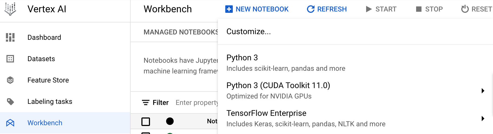
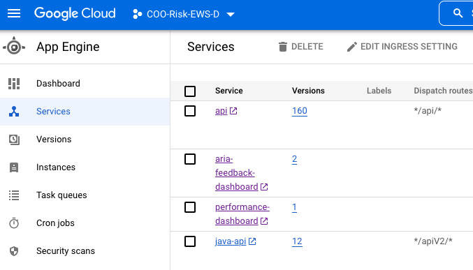

# ING Code Breakfast - Deploy Dash app to GPC App Engine

In this code breakfast we will see how to create a data visualization app with [Dash](https://dash.plotly.com/) and deploy it to [GCP App Engine](https://cloud.google.com/appengine) so to make it available for our users.

This code assumes that a GCP environment is available. In particular the following services are required:
- Big Query
- Cloud Storage
- Vertex AI notebooks
- App Engine

--- 

## Step 1: Create notebook

First thing we need to do is creating a jupyter notebook in GCP Vertex AI workbench.
To do that, we can navigate to Vertex AI -> Workbench -> User-managed notebooks -> New notebook -> Python3



Please specify:

- Notebook name = 'notebook_group_X' (replace X with number of the group)
- Region = europe-west1 (Belgium)
- Zone = europe-west-1-b

Once the notebook has been created, we can click on 'Open JupyterLab' and get access to our Jupyter environment.
Here we can clone this repository by opening the terminal and typing:

```
git clone https://github.com/chrispiro/deploy_plotly_app_on_gcp.git
```

And then we can install the required packages by running:
```
pip install -r requirements.txt
```

---

## Step 2: Read data from BigQuery or Cloud Storage

The dataset we are going to use is ['World Population Dataset'](https://www.kaggle.com/datasets/iamsouravbanerjee/world-population-dataset) from [Kaggle](https://www.kaggle.com/).
For demonstration purposes, we have loaded the dataset in BigQuery and CloudStorage and we will show how to load the data from there into our application.

Follow the instructions in the module `load_data.py` to load the data from the two services alternatively.

---

## Step 2: Create Plotly visualizations

A core component of our application is of course the plotly visualizations.

Follow the instructions in the module `create_charts.py` to create the plotly visualizations based on the data we loaded in the previous step.

---

## Step 3: Create Dash App

In this step, we will create our `main` module that imports the charts that we created in the previous step and defines the layout of our Dash App.

Follow the instructions in the module `main.py`.

---

## Step 4: Deployment of the application to GCP App Engine

In this step we will see how to deploy the Dash application to App Engine, by defining the `app.yaml` file and using a flexible environment. The Flex environment allows our app to communicate with the other services in the GCP VPC (Virtual Private Cloud) network

You can then run the following command in the terminal to deploy the application:

```
gcloud app deploy
```

---

## Step 5: Check that our application is running properly

Last step is to check that the application we built and deployed is working as expected.
To do that, in GCP we can navigate to App Engine -> Services and click on the application we just deployed.

Replace this image:


This will redirect us to the application web page. Our users will be able to use the application by simply accessing the URL.